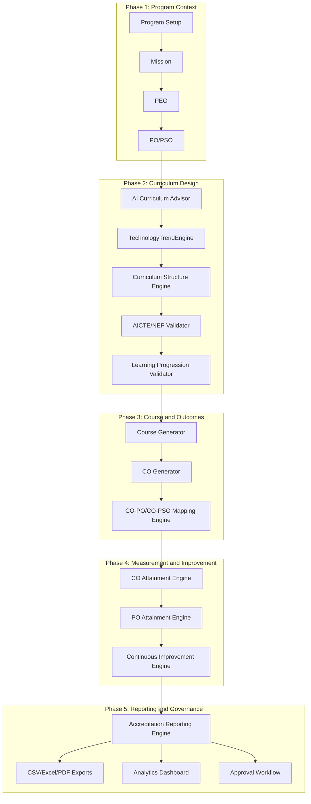

# CURRICULUM_ENGINE_FINAL_AUDIT

**Version:** 1.1  
**Date:** March 2026  
**Auditor:** Senior Software Architect + NBA Accreditation Expert + AI Systems Engineer  

---

## 1. System Overview

The platform is now an AI-assisted OBE workflow engine that covers:

- Program setup and governance context
- Mission -> PEO -> PO/PSO alignment
- Curriculum structure generation and validation
- Course and CO generation
- CO-PO / CO-PSO normalized mapping
- CO and PO attainment
- Continuous improvement tracking
- Syllabus generation
- Accreditation analytics and report exports
- Human approval state transitions

Tech stack:

- Next.js App Router
- PostgreSQL/Supabase
- Gemini-assisted generation with deterministic fallbacks

---

## 2. Architecture Diagram



---

## 3. Database Schema

### Core OBE Context

```sql
programs
program_peos
program_outcomes
program_psos
```

### Curriculum Structures

```sql
curriculum_versions
curriculums
curriculum_category_credits
curriculum_electives_settings
curriculum_semester_categories
curriculum_generated_courses
curriculum_course_outcomes
```

### Normalized Mapping Layer

```sql
co_po_mapping (co_id, po_id, strength)
co_pso_mapping (co_id, pso_id, strength)
```

### Attainment + Improvement

```sql
co_attainment
po_attainment
continuous_improvement
```

### Syllabus + Governance

```sql
course_syllabus
approval_status / approved_by / approved_at (across key curriculum artifacts)
```

### Feedback Integration

```sql
stakeholder_feedback
program_vmpeo_feedback_submissions
program_vmpeo_feedback_entries
```

---

## 4. AI Agents

| Agent | Responsibility | Output |
|---|---|---|
| `vision-agent` | Vision generation with quality scoring | Vision candidates |
| `mission-agent` | Mission generation and ranking | Mission statements |
| `peo-agent` | PEO generation and quality filtering | Program PEOs |
| `po-agent` | PO generation (WA/NBA aligned style) | Program Outcomes |
| `pso-agent` | Program-specific outcome generation | PSOs |
| `curriculum-advisor-agent` | Category distribution + electives | Advisor recommendations |
| `course-generator-agent` | Curriculum/course structure generation | Semester-wise courses |
| `co-generator-agent` | CO generation per course | Course outcomes |
| `mapping-agent` | CO-PO/CO-PSO correlation shaping | Mapping rows |
| `validator-agent` | AICTE/NEP/progression/domain checks | Pass/Fail + diagnostics |
| `attainment-agent` | CO and PO attainment computation helper | Attainment values |
| `report-generator-agent` | Accreditation report orchestration | Report summaries |

---

## 5. API Endpoints

### Generation and Core Curriculum

```text
POST /api/ai/generate-curriculum
POST /api/ai/regenerate-semester
POST /api/curriculum/advisor
POST /api/curriculum/save
GET  /api/curriculum/structure
GET  /api/curriculum/courses
POST /api/curriculum/generate-outcomes
POST /api/curriculum/generate-syllabus
GET  /api/curriculum/generate-syllabus
GET  /api/curriculum/technology-trends
POST /api/curriculum/technology-trends
```

### Versioning / Catalog

```text
GET  /api/curriculum/versions
POST /api/curriculum/versions
PATCH /api/curriculum/versions/[id]
GET  /api/curriculum/curriculums
POST /api/curriculum/curriculums
```

### Attainment / Improvement

```text
GET|POST /api/attainment/co
GET|POST /api/attainment/po
GET|POST|DELETE /api/attainment/continuous-improvement
```

### Reporting / Governance

```text
POST /api/curriculum/accreditation-report      (json/csv/excel/pdf)
GET|PATCH /api/curriculum/approval
GET /api/stakeholder/feedback/analytics
```

---

## 6. Data Flow & Input/Output Connections

1. Program mission/objective context is established (`Mission -> PEO -> PO/PSO`).
2. Curriculum advisor proposes distribution and trend-aligned recommendations.
3. Curriculum engine generates semester structures and courses.
4. Validator blocks invalid curriculum using AICTE/NEP + progression/domain checks.
5. COs are generated with strict domain guardrails and Bloom constraints.
6. Outcomes persist to both array form (`curriculum_course_outcomes`) and normalized mapping tables (`co_po_mapping`, `co_pso_mapping`).
7. CO attainment is computed using:

```text
CO_Attainment = (Internal_Assessment × 0.3) + (External_Exam × 0.7)
```

8. PO attainment is derived from mapped CO attainment with strength weighting.
9. Continuous improvement logs issues, actions, and next-cycle plans.
10. Accreditation reports assemble matrices and export in CSV/Excel/PDF formats.

---

## 7. Accreditation Compliance

- **NBA OBE Model:** ✅ Mission -> PEO -> PO/PSO -> CO -> CO/PO mapping traceability present.
- **Washington Accord:** ✅ PO-driven outcome modeling supported with mapped evidence.
- **AICTE Model Curriculum:** ✅ Category distribution and credit checks enforced by validator.
- **NEP 2020:** ✅ Foundation progression, internship/capstone requirements, multidisciplinary coverage checks present.

---

## 8. Improvements Implemented

1. **Program context hardening** for generation and save flows (no blind program fallback).
2. **Learning progression + domain integrity validator** with blocking rules.
3. **TechnologyTrendEngine** and trend-aware advisor enrichment.
4. **Normalized CO mappings** (`co_po_mapping`, `co_pso_mapping`) alongside array compatibility.
5. **CO/PO attainment APIs** and persistence (`co_attainment`, `po_attainment`).
6. **Continuous improvement API** for NBA SAR evidence cycle.
7. **Syllabus generation API** with deterministic fallback and DB persistence.
8. **Accreditation report engine expansion** (mandatory matrices + CSV/Excel/PDF export modes).
9. **Approval workflow API** for Draft -> Faculty Review -> HOD Approved lifecycle.
10. **Accreditation analytics panel** for attainment, feedback, and distribution visuals.

---

## 9. System Evaluation

| Category | Score / 10 | Realities |
|---|:---:|---|
| **Architecture** | **9.2** | Clear phase separation with reusable agents and enforceable workflow boundaries. |
| **AI Pipeline** | **9.0** | Guardrails + deterministic fallback reduce drift and improve reliability. |
| **Accreditation Compliance** | **8.8** | Core matrices and attainment flows are in place; deeper evidence automation can still grow. |
| **Data Integrity** | **8.5** | Normalized mappings, version/curriculum linkage, and governance fields strengthen traceability. |
| **Scalability** | **8.7** | Modular APIs and normalized schema support multi-program growth. |
| **FINAL SCORE** | **9.0** | **PRODUCTION-ORIENTED OBE PLATFORM** |

---

## 10. Future Enhancements (Roadmap)

1. Target/threshold benchmarking for CO/PO attainment (with alerts).
2. Native multi-sheet `.xlsx` writer with audit-ready formatting templates.
3. Digitally signed approval evidence and immutable audit trail exports.
4. Automated remediation recommendation engine from low-attainment PO trends.
5. Policy-driven curriculum lock/publish workflows by institution role.
6. Live external trend ingestion adapters (scheduled pulls + versioned trend snapshots).

---

## 11. Student Learning Progression & Technology Alignment Framework

The Curriculum Engine enforces a layered learning model to balance:

1. Fundamental backbone
2. Core program knowledge
3. Emerging technology integration

This is implemented in both AI prompts and validator enforcement.

### 11.1 Layer 1 — Fundamental Backbone

Mandatory foundation checks enforce presence of:

- Mathematics
- Physics/Science
- Basic Engineering foundation

Year-1/early-semester curriculum is blocked if foundational coverage is missing.

### 11.2 Layer 2 — Core Discipline Knowledge

Domain-specific backbone is enforced using program-aware profiles.

Examples:

- **CSE:** Data Structures, OS, Networks, Database, Algorithms
- **MECH:** Thermodynamics, Fluid Mechanics, Machine Design, Manufacturing, SOM

### 11.3 Layer 3 — Emerging Technologies

Higher-semester integration checks ensure modern topics are present without replacing core fundamentals.

Examples:

- **CSE:** AI, ML, Cloud, Cybersecurity, Blockchain, Generative AI
- **MECH:** Robotics, Advanced Manufacturing, Digital Twin, Additive Manufacturing

### 11.4 Learning Progression Model

```text
Year 1 -> Fundamentals
Year 2 -> Core Engineering
Year 3 -> Advanced Domain
Year 4 -> Specialization + Emerging Technologies + Capstone
```

Bloom progression intent:

```text
Understanding -> Application -> Design -> Innovation
```

### 11.5 AI Curriculum Validation (Blocking Rules)

Validator now blocks structures that violate:

1. Fundamental subject existence
2. Core domain subject existence
3. Emerging technology coverage in upper semesters
4. Prerequisite ordering
5. Domain integrity (restricted unrelated topics)

### 11.6 Program-Specific AI Alignment

All AI generation uses guardrail prompts with:

- Program name and domain
- Allowed backbone topics
- Emerging topic expectations
- Restricted-topic constraints
- Progression logic

### 11.7 Standard Guardrail Prompt (Used in AI Flows)

```text
You are generating curriculum content for an engineering program.

Program Name: {PROGRAM_NAME}
Program Domain: {DOMAIN}

STRICT RULES
1. Maintain balance between fundamentals, core discipline, and emerging technologies.
2. Enforce progression Year1->Year4 as defined.
3. Do not remove essential foundations (Mathematics, Physics, Basic Engineering).
4. Preserve disciplinary backbone.
5. Integrate relevant modern technologies.
6. Align outcomes with PEOs and POs.
7. Enforce Bloom's taxonomy for outcomes.
8. Reject unrelated discipline topics.
```

### 11.8 TechnologyTrendEngine Module

`TechnologyTrendEngine` (`lib/curriculum/technology-trend-engine.ts`) provides domain trend snapshots with:

- high-demand skill themes
- suggested electives
- suggested skill modules
- source references (IEEE, ACM, WEF, GitHub Trends, Stack Overflow Insights)

### 11.9 Updated Logical Architecture

```text
Program Setup
 -> Mission
 -> PEO
 -> PO/PSO
 -> Curriculum Advisor
 -> TechnologyTrendEngine
 -> Curriculum Structure
 -> Learning Progression Validator
 -> Course Generator
 -> CO Generator
 -> CO-PO Mapping
 -> CO/PO Attainment
 -> Continuous Improvement
 -> Accreditation Reports
```
